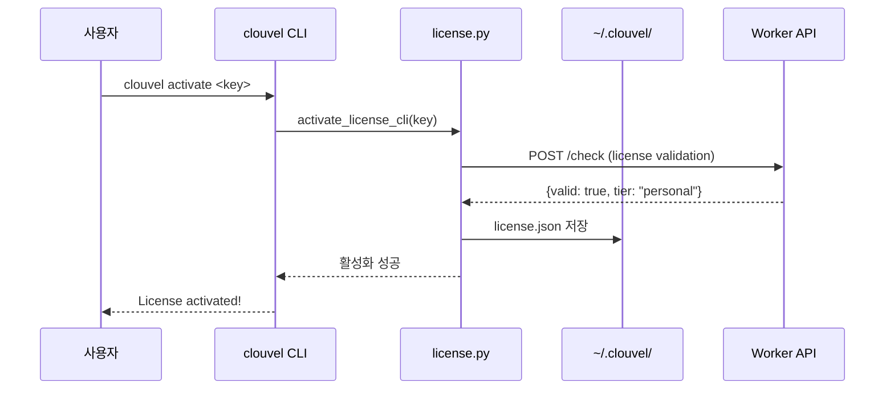
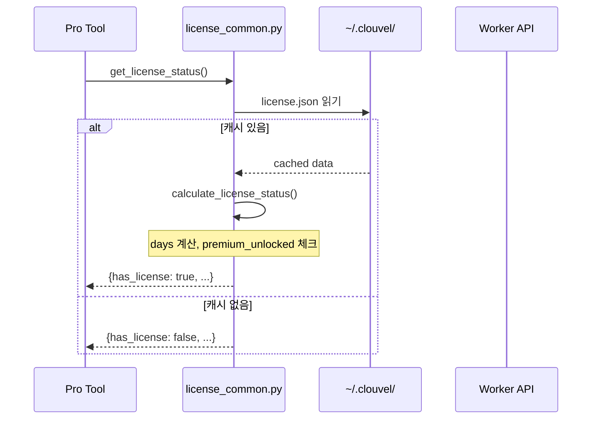

# License Activation 코드 플로우

> 작성일: 2026-01-26
> 버전: v1.8.0 기준

---

## (A) 엔트리포인트 목록

| 엔트리포인트 | 파일:라인 | 설명 |
|-------------|-----------|------|
| CLI `activate` | `server.py:1950` | `clouvel activate <key>` 명령 |
| MCP Tool `activate_license` | `server.py:696` | MCP 도구 정의 |
| MCP Handler | `server.py:843` | `"activate_license": lambda args: _wrap_activate_license(args)` |
| Wrapper 함수 | `server.py:1436` | `async def _wrap_activate_license(args)` |

---

## (B) 호출 그래프

```
[CLI: clouvel activate <key>]
        │
        ▼
server.py:1950 ─── args.command == "activate"
        │
        ▼
license.py:activate_license_cli() 또는 license_free.py (fallback)
        │
        ├─── 로컬 캐시 저장 (~/.clouvel/license.json)
        │
        └─── Worker API 검증 (선택적)
                │
                ▼
        clouvel-license-webhook.vnddns999.workers.dev/check


[MCP: activate_license]
        │
        ▼
server.py:843 ─── HANDLER_MAP["activate_license"]
        │
        ▼
server.py:1436 ─── _wrap_activate_license(args)
        │
        ▼
license.py:activate_license_cli() 또는 license_free.py
```

---

## (C) 시퀀스 다이어그램

### License Activation Flow



### License Check Flow (도구 호출 시)



---

## (D) 근거 코드

| 파일 | 라인 | 내용 |
|------|------|------|
| `server.py` | 64-66 | `from .license import activate_license_cli` (try/except) |
| `server.py` | 1950-1954 | CLI activate 명령 처리 |
| `server.py` | 1436-1452 | `_wrap_activate_license()` MCP wrapper |
| `license_common.py` | 143-168 | `load_license_cache()`, `save_license_cache()` |
| `license_common.py` | 194-255 | `calculate_license_status()` |
| `license_common.py` | 262-284 | `create_license_data()` |
| `license.py` | 43 | Worker URL 정의 |
| `license.py` | 165 | `requests.post()` 라이선스 검증 |

---

## (E) 라이선스 데이터 구조

### ~/.clouvel/license.json

```json
{
  "key": "XXXX-XXXX-XXXX-XXXX",
  "license_key": "XXXX-XXXX-XXXX-XXXX",
  "activated_at": "2026-01-26T10:30:00",
  "machine_id": "abc123...",
  "tier": "personal",
  "tier_info": {
    "name": "Personal",
    "price": "$29",
    "seats": 1
  }
}
```

### Tier 정보

| Tier | Price | Seats | 설명 |
|------|-------|-------|------|
| personal | $29 | 1 | 개인용 |
| team | $79 | 10 | 팀용 |
| enterprise | $199 | 999 | 기업용 |
| developer | $0 | 999 | 개발자 모드 |

---

## (F) 관련 파일

| 파일 | 역할 |
|------|------|
| `license.py` | Pro 버전 라이선스 로직 (PyPI 제외) |
| `license_free.py` | Free 버전 stub (PyPI 포함) |
| `license_common.py` | 공통 로직 (캐시, 상태 계산) |
| `server.py` | CLI/MCP 엔트리포인트 |

---

## 참조

- Worker: `clouvel-license-webhook.vnddns999.workers.dev`
- Data Contract: [License API 스키마](../data_contracts.md)
