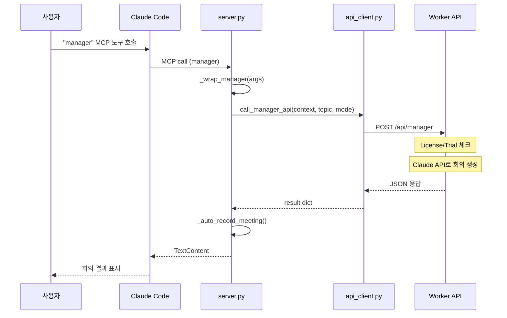
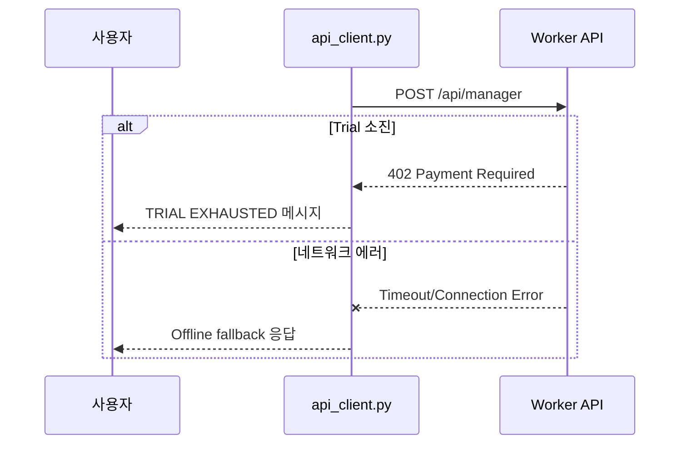

# Manager 기능 코드 플로우

> 작성일: 2026-01-26
> 버전: v1.8.0 기준
> 상태: **Worker API 사용** (ADR-0001)

---

## (A) 엔트리포인트 목록

| 엔트리포인트 | 파일:라인 | 설명 |
|-------------|-----------|------|
| MCP Tool `manager` | `server.py:571` | Tool 정의 |
| MCP Handler | `server.py:826` | `"manager": lambda args: _wrap_manager(args)` |
| Wrapper 함수 | `server.py:1193` | `async def _wrap_manager(args)` |
| API Client | `api_client.py:48` | `def call_manager_api()` |

---

## (B) 호출 그래프 (v1.8.0)

```
[Claude Code MCP 호출]
        │
        ▼
server.py:826 ─── HANDLER_MAP["manager"]
        │
        ▼
server.py:1193 ─── _wrap_manager(args)
        │
        ▼
api_client.py:48 ─── call_manager_api()
        │
        ▼
POST https://clouvel-api.vnddns999.workers.dev/api/manager
        │
        ▼
Worker가 Claude API로 회의 생성
        │
        ▼
응답 반환 (JSON)
```

### 근거 코드

| 파일 | 라인 | 내용 |
|------|------|------|
| `server.py` | 19 | `from .api_client import call_manager_api` |
| `server.py` | 1193-1225 | `_wrap_manager()` 함수 - `call_manager_api()` 호출 |
| `api_client.py` | 48-123 | `call_manager_api()` 정의 - Worker API 호출 |
| `api_client.py` | 82-89 | `requests.post(f"{API_BASE_URL}/api/manager", ...)` |

---

## (C) 시퀀스 다이어그램

### v1.8.0 구현 (Worker API 호출)



### 에러 케이스



---

## (D) v1.7.x → v1.8.0 변경 사항

### 이전 구현 (v1.7.x, 로컬 실행)

```
_wrap_manager() → generate_meeting_sync() → tools/manager/ (로컬)
                → manager() → tools/manager/ (로컬)
```

**문제**: `tools/manager/`가 PyPI 빌드에서 제외 → ImportError

### 현재 구현 (v1.8.0, Worker API)

```
_wrap_manager() → call_manager_api() → Worker API (원격)
```

**해결**: 로컬 모듈 의존성 제거, 모든 로직이 Worker에서 실행

| 항목 | v1.7.x | v1.8.0 |
|------|--------|--------|
| 실행 위치 | 로컬 | Worker API |
| PyPI 설치 | ImportError | 정상 작동 |
| 네트워크 | 불필요 | 필수 |
| Trial 체크 | 로컬 | 서버 |

---

## (E) 관련 파일

| 파일 | 역할 |
|------|------|
| `server.py` | MCP 서버, `_wrap_manager()` 정의 |
| `api_client.py` | Worker API 클라이언트 |
| `tools/__init__.py` | ~~manager import~~ (v1.8.0에서 제거) |
| `tools/manager/` | ~~로컬 로직~~ (v1.8.0에서 미사용) |

---

## 참조

- ADR-0001: [Manager 실행 아키텍처 결정](../DECISION_LOG/ADR-0001-manager-execution.md)
- Data Contract: [/api/manager 스키마](../data_contracts.md)
