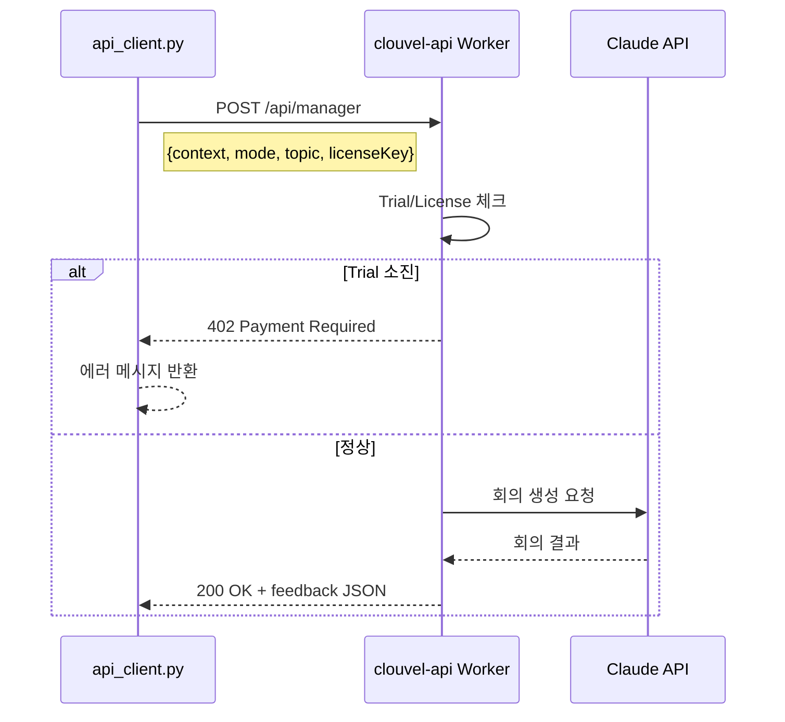
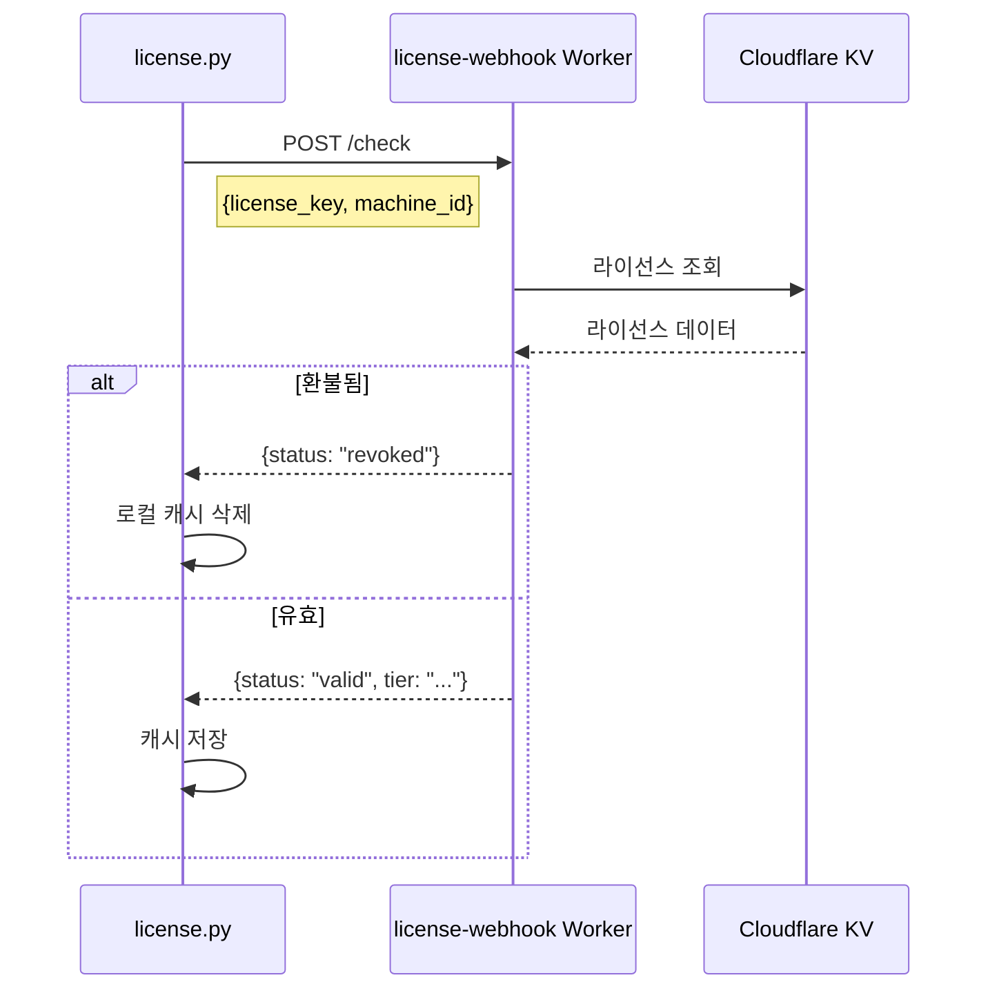
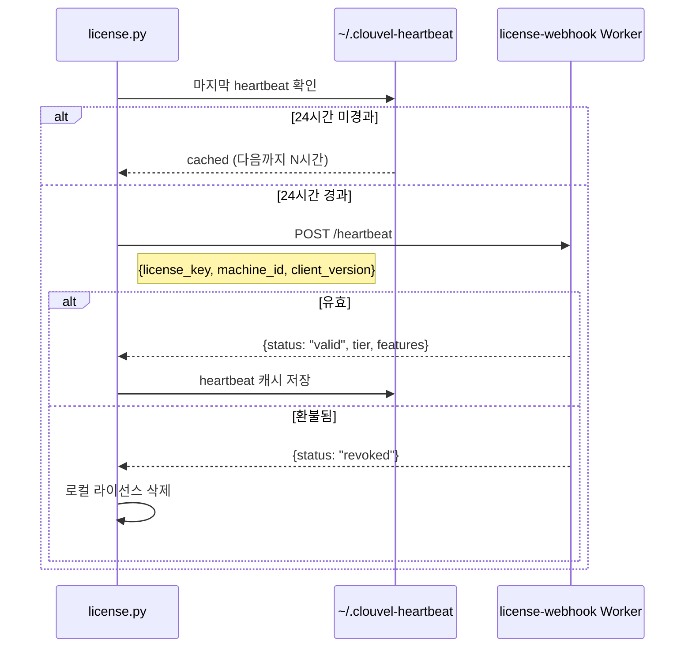
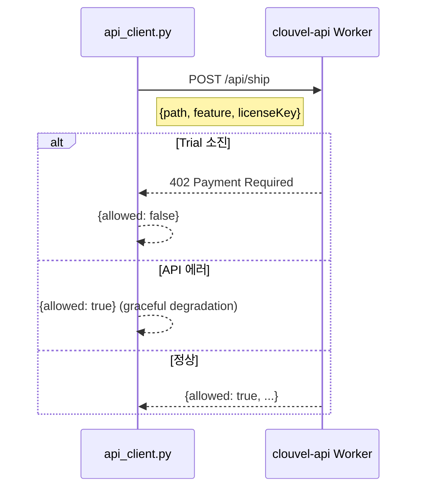
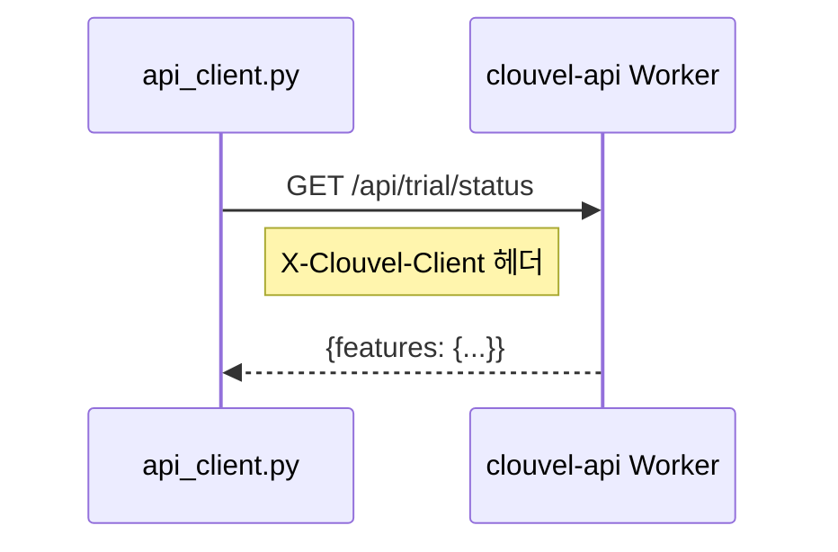

# Worker API 통신 플로우

> 작성일: 2026-01-26
> 버전: v1.8.0 기준

---

## (A) Worker 엔드포인트 목록

| Worker | URL | 용도 |
|--------|-----|------|
| clouvel-api | `https://clouvel-api.vnddns999.workers.dev` | Manager, Ship, Trial 상태 |
| clouvel-license-webhook | `https://clouvel-license-webhook.vnddns999.workers.dev` | 라이선스 검증, Heartbeat, 콘텐츠 제공 |
| clouvel-pro-download | `https://clouvel-pro-download.vnddns999.workers.dev` | Pro 모듈 다운로드 |

---

## (B) 인증 체계

### 클라이언트 식별 (Trial 추적용)

```python
# api_client.py:20-24
def _get_client_id() -> str:
    machine_info = f"{platform.node()}-{platform.machine()}-{os.getlogin()}"
    return hashlib.sha256(machine_info.encode()).hexdigest()[:32]
```

### 라이선스 키 조회 순서

```
1. 환경변수: CLOUVEL_LICENSE_KEY
2. 파일: ~/.clouvel/license.json → key 필드
3. None (Trial 모드)
```

### 공통 헤더

```http
Content-Type: application/json
X-Clouvel-Client: {client_id_hash}
```

---

## (C) API 엔드포인트별 플로우

### 1. POST /api/manager (clouvel-api)

**파일**: `api_client.py:48-124`



**재시도**: 없음 (에러 시 fallback 응답)
**타임아웃**: 30초

### 2. POST /check (clouvel-license-webhook)

**파일**: `license.py:43, 165`



**재시도**: 없음
**타임아웃**: 15초 (CONDITIONAL - 코드에서 직접 확인 필요)

### 3. POST /heartbeat (clouvel-license-webhook)

**파일**: `license.py:68, 165-196`



**인터벌**: 24시간 (`HEARTBEAT_INTERVAL_SECONDS = 86400`)
**오프라인 유예**: 3일 (`OFFLINE_GRACE_DAYS = 3`)
**타임아웃**: 15초

### 4. POST /api/ship (clouvel-api)

**파일**: `api_client.py:126-172`



**특징**: API 실패 시에도 로컬 실행 허용 (graceful degradation)
**타임아웃**: 30초

### 5. GET /api/trial/status (clouvel-api)

**파일**: `api_client.py:175-192`



**타임아웃**: 30초

### 6. Content API (clouvel-license-webhook)

**파일**: `content_api.py:43, 248`

```
POST /content
- 라이선스 검증 후 Shovel 콘텐츠 제공
- 로컬 캐시: 24시간 유효
- DEV_MODE 시 로컬 shovel 디렉토리 사용
```

---

## (D) 에러 처리

### HTTP 상태 코드

| 코드 | 의미 | 클라이언트 처리 |
|------|------|---------------|
| 200 | 성공 | 정상 처리 |
| 402 | Trial 소진 | 업그레이드 안내 |
| 401 | 인증 실패 | 라이선스 재활성화 안내 |
| 500 | 서버 에러 | fallback 응답 |

### Fallback 응답 (오프라인 모드)

```python
# api_client.py:195-242
def _fallback_response(error_message: str) -> Dict[str, Any]:
    return {
        "topic": "feature",
        "active_managers": ["PM", "CTO", "QA"],
        "feedback": {...},
        "formatted_output": "## 💡 C-Level Perspectives (Offline Mode)...",
        "offline": True,
    }
```

---

## (E) 환경변수 오버라이드

| 환경변수 | 기본값 | 용도 |
|---------|--------|------|
| `CLOUVEL_API_URL` | `https://clouvel-api.vnddns999.workers.dev` | Main API |
| `CLOUVEL_REVOKE_CHECK_URL` | `https://clouvel-license-webhook.../check` | 라이선스 체크 |
| `CLOUVEL_HEARTBEAT_URL` | `https://clouvel-license-webhook.../heartbeat` | Heartbeat |
| `CLOUVEL_CONTENT_SERVER_URL` | `https://clouvel-license-webhook...` | 콘텐츠 서버 |
| `CLOUVEL_LICENSE_KEY` | - | 라이선스 키 직접 지정 |

---

## (F) 보안 고려사항

### 서명 (CONDITIONAL)

현재 코드에서 요청 서명(HMAC 등)은 확인되지 않음. Worker 측 구현 확인 필요.

### 민감 데이터

| 데이터 | 전송 여부 | 용도 |
|--------|----------|------|
| license_key | O | 라이선스 검증 |
| machine_id | O | 기기 식별 |
| client_id (hash) | O | Trial 추적 |
| context (manager) | O | 회의 생성 |

### Rate Limiting (CONDITIONAL)

Worker 측 rate limit 정책은 코드에서 확인 불가. Worker 구현 확인 필요.

---

## (G) 근거 코드

| 항목 | 파일 | 라인 |
|------|------|------|
| API Base URL | `api_client.py` | 16 |
| Client ID 생성 | `api_client.py` | 20-24 |
| License Key 조회 | `api_client.py` | 27-45 |
| Manager API 호출 | `api_client.py` | 82-90 |
| Ship API 호출 | `api_client.py` | 145-153 |
| Trial 상태 조회 | `api_client.py` | 178-184 |
| Fallback 응답 | `api_client.py` | 195-242 |
| Heartbeat URL | `license.py` | 68 |
| Heartbeat 전송 | `license.py` | 165-196 |
| Revoke Check URL | `license.py` | 43 |
| Content Server URL | `content_api.py` | 43 |

---

## 참조

- [Manager Flow](flow_manager.md)
- [Activate Flow](flow_activate.md)
- [Data Contracts](../DATA_CONTRACTS.md)
